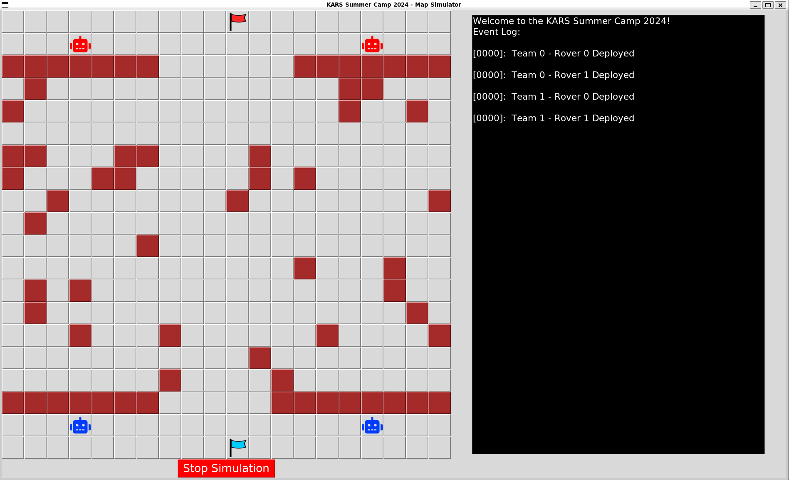

# MQTT Communication & Security Module

[](https://www.gnu.org/licenses/gpl-3.0)

This project is composed of two parts. The first is a set of MQTT clients with a simulator designed
specifically for simulating the environment of the KARS Summer 2024 physical CTF competition. The second part is a repurposed version of the [MQTT-PWN project](https://github.com/akamai-threat-research/mqtt-pwn)
that demonstrates vulnerabilities and the corresponding security practices of MQTT
communication.

The simulator's purpose is to aid in designing and testing a game environment to account for various scenarios that may occur during the competition. Obstacles within the central field are currenly positioned randomly when the simulation is started. The environment allows for adding and testing various pathfinding and surveying algorithms (the default is A* with frontier-based exploration) as well as configuring and testing communication between the team's rovers through an MQTT broker.



## Installation
The following installation and configuration instructions are for a Linux-based
system. The project has been tested on WSL (Ubuntu kernel) and Raspberry Pi OS using Python 3.10. You do not need to install the simulator to run the MQTT-PWN project (and vice versa). Either way, you need to start by cloning the project repository.

```bash
git clone https://github.com/KARS-kwt/mqttproj
```

### Installing the simulator

1. Create a new Python virtual environment then activate it:

    ```bash
    python3 -m venv .venv
    source .venv/bin/activate
    ```

2. Install dependencies:

    ```bash
    pip install -r simulator/requirements.txt
    ```

3. Install the Eclipse Mosquitto MQTT broker (on either the same machine as the clients or a different one):
    
     ```bash
     sudo apt install mosquitto
     ```

<!--
### Installing the MQTT-PWN project (under development)
-->

## Configuration

### Broker Configuration

#### Local Broker:
If you have installed the broker locally on the same machine as the subscriber/publisher clients then you can use the default broker address and port by running:

```bash
mosquitto -v
```

This will run the broker as a program that will allow you to view the connections and messages being sent and received. Alternatively you can start and stop the broker as a service:
    
 ```bash
 sudo systemctl start mosquitto
 sudo systemctl stop mosquitto
 ```

#### Network Broker:
If you have installed the broker on a different machine, you will need to configure the `BROKER_NETWORK_ADDRESS` and `BROKER_NETWORK_PORT` variables in the `simulator/config.py` file. You will then need to create a custom configuration file:

 ```bash
 sudo nano /etc/mosquitto/conf.d/myconf.conf
 ```

And add the following lines to the file to allow the broker to listen on port 1883 for ANY connections:

 ```bash
 listener 1883
 allow_anonymous true
 ```

Note, if the broker is running on WSL, you need to expose the broker's port to the host machine on another port.
For example, if the broker is listening on port 1883 in WSL, you can expose it to, e.g. port 5000 on the host machine by running the following command in the PowerShell terminal:
    
```bash
netsh advfirewall firewall add rule name="Allowing MQTT connections" dir=in action=allow protocol=TCP localport=5000
netsh interface portproxy add v4tov4 listenaddress=0.0.0.0 listenport=5000 connectaddress=localhost connectport=1883
```

#### Testing the Broker:
To test the broker, you can run the built-in `mosquitto_pub` and `mosquitto_sub` commands from the client. For example, to publish a message to the topic `test`:

```bash
mosquitto_pub -t test -m "Hello, World!"
```

And to subscribe to the topic `test`:

```bash
mosquitto_sub -t test
```

One (e.g., an attacker) can also use the `mosquitto_sub` command to subscribe to all topics by using the `#` wildcard:

```bash
mosquitto_sub -t '#'
```

### Simulator Configuration

All configuration settings for the simulation's environment are stored in the `simulator/config.py` file. The following are
the default settings:

```python
# Game Parameters
NUM_TEAMS = 2
GRID_ROWS = 20
GRID_COLS = 20
NUM_OBSTACLES = 40
TIMESTEP = 1000

# Network Parameters
BROKER_LOCAL_ADDRESS = "localhost"              # Client uses this if broker is running on the same machine
BROKER_PORT = 1883                              # Default MQTT port is 1883

BROKER_NETWORK_ADDRESS = "192.168.1.140"        # Client uses this if broker is running on another machine (on LAN)
BROKER_NETWORK_PORT = 5000                      # Client uses this if broker is running on WSL and exposed to the host

# Connection Parameters
MSG_COUNT = 3
```

<!--
### MQTT-PWN Local Testing
To test the project locally (non-dockerized) set the `MQTT_PWN_TESTING_ENV`
environment variable to `True`:

```bash
export MQTT_PWN_TESTING_ENV=True
```

Then run the project:

```bash
python mqtt_pwn_tool/run.py
```

To revert to dockerized testing, unset the `MQTT_PWN_TESTING_ENV` environment
variable:

```bash
unset MQTT_PWN_TESTING_ENV
```
>

